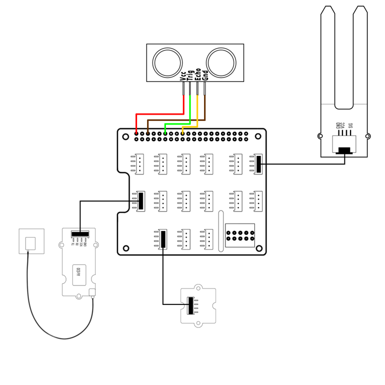

# AquaBots

Turn your raspberry-pi into a full-fledged aquatic drone!


## Installing

Before anything else, you have to install everything. This process is described [here](/INSTALL.md)

## Connect the hardware

At this moment there are four sensors to be connected to the RPI. The following picture describes how to do this. There is also a guide, found in [the document folder](/docs/Pi%20Sensors%20Assembly%20Guide%20Eng.pdf)



## Running the API

On the raspberry pi, run the following file:
- src/API/api.py

This is an API that will use the sensors, and send the data. The GUI uses this API to get.

## Running the GUI

On the host laptop, run the following file:
- src/GUI/gui.py

When this file is running, visit the webpage on http://127.0.0.1:5000/ 

Here you can specify the access code of the thingsboard device. (If you do not have an access code, follow *this* guide). When this is done, you can set a pin and interval for a specific sensor, and enable it. It will automatically send all data to the thingsboard of the specified accesscode.


## Static data tests
If you want to test thingsboard but don't have the RPI connected, in src/GUI/gui.py you can change a boolean to use static data:


```python
# True: get actual data. False: get static data.
PULL_DATA_FROM_API = False
```